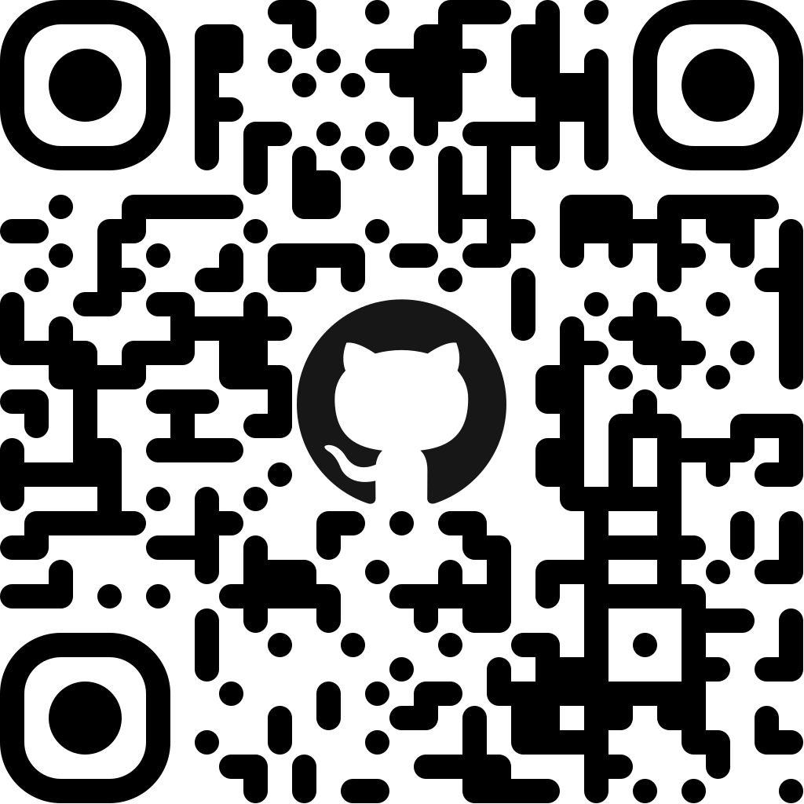
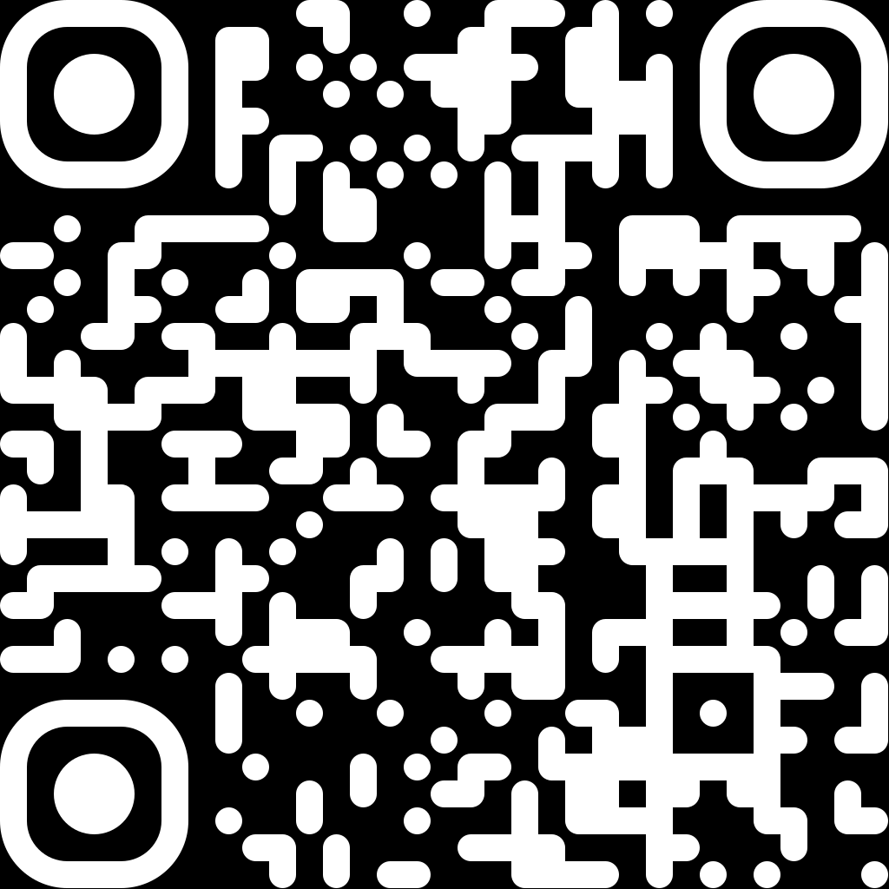
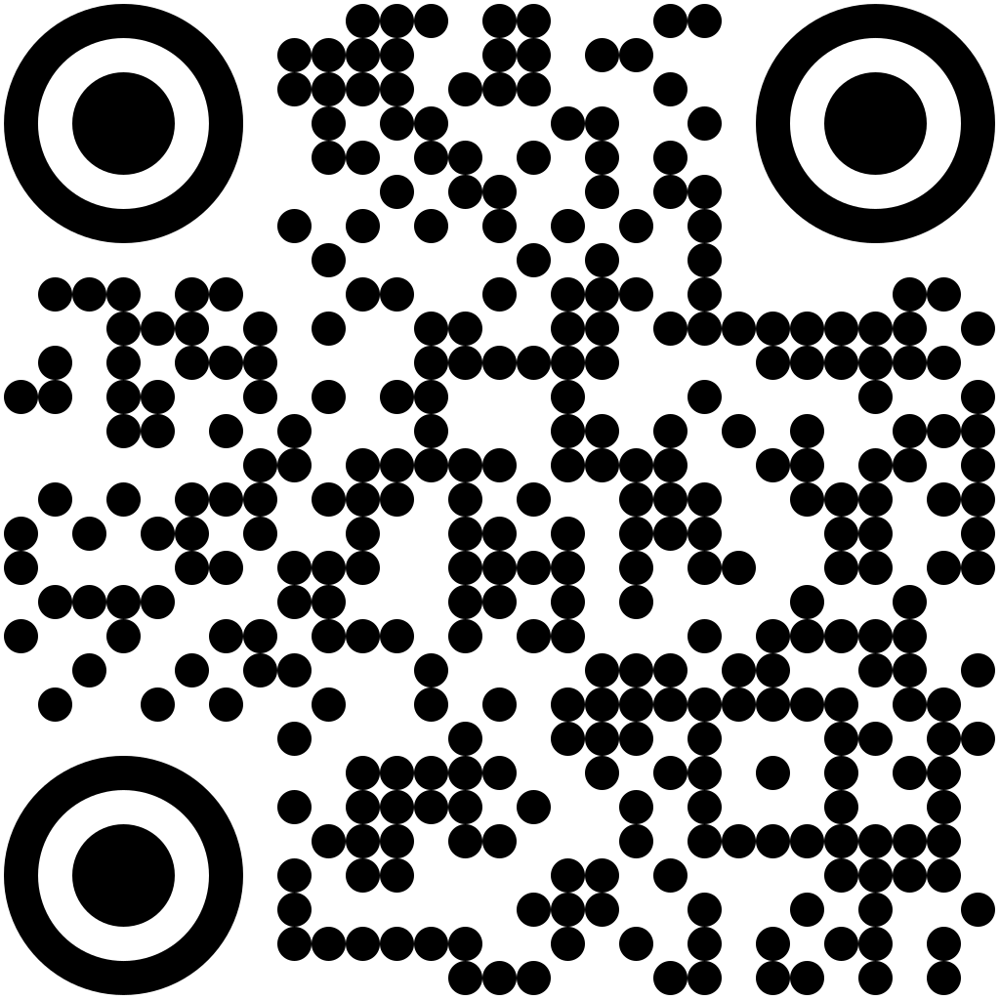
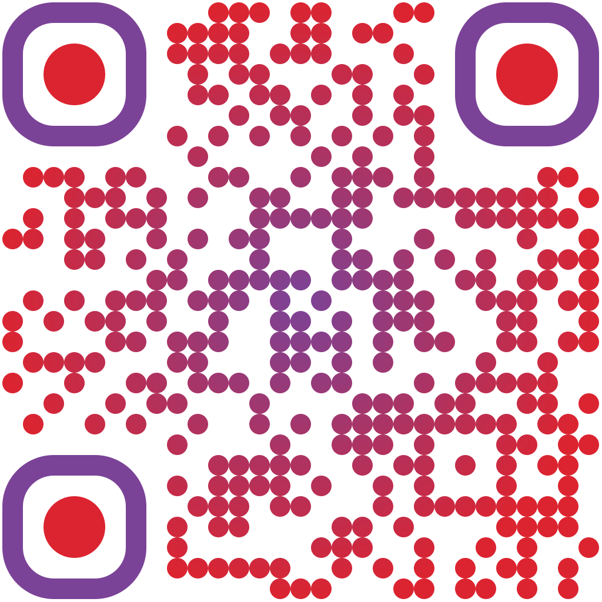
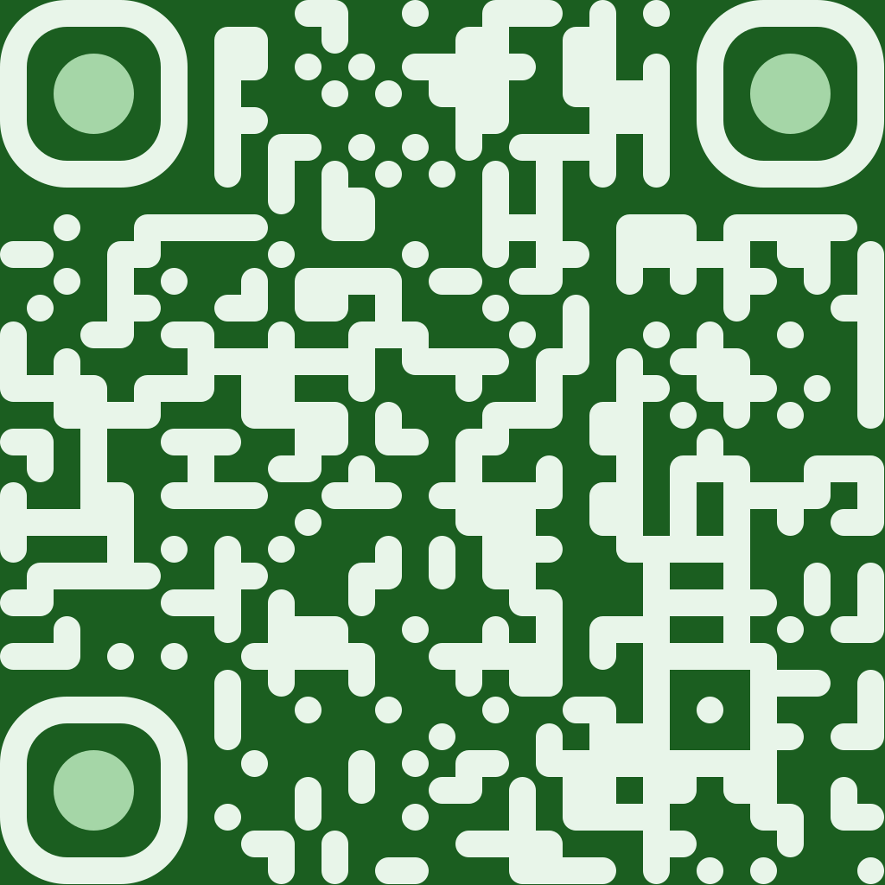
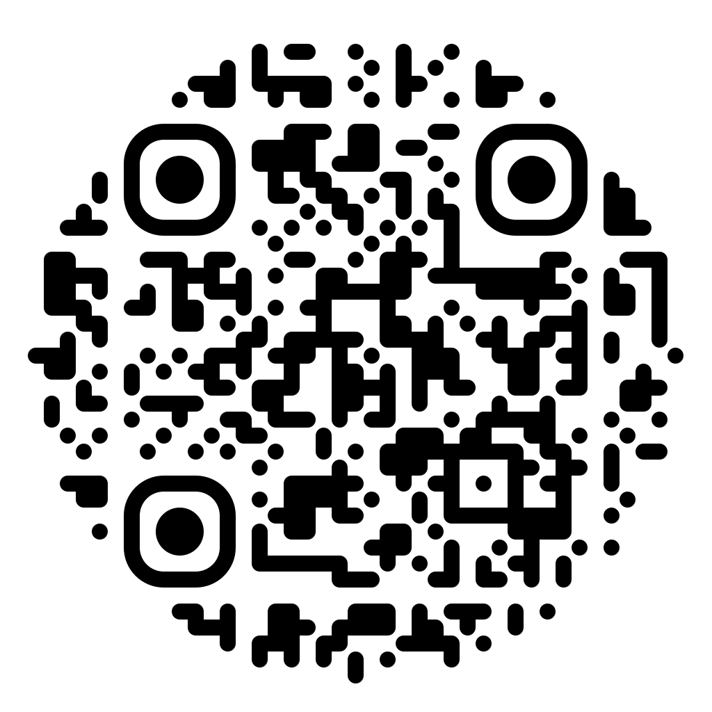

# qrty

  

`qrty` is a commandline interface to
[qr-code-styling](https://github.com/kozakdenys/qr-code-styling) driven by style profiles, and with automatic center logo/icon fetching based on domain. It is also capable of restyling existing QRs while preserving their data patterns.

## Contents

- [Quickstart](#quickstart)
- [Gallery](#gallery)
- [Requirements](#requirements)
- [Install](#install)
- [Usage](#usage)
- [Profiles](#profiles)
- [PNG output](#png-output)
- [Restyle an existing QR](#restyle-an-existing-qr---restyle)
- [Tests](#tests)
- [Credits](#credits)
- [License](#license)

## Quickstart

    npm install -g qrty                                # puts `qrty` on your PATH
    qrty black https://www.directrelief.org/           # plain
    qrty ocean https://www.doctorswithoutborders.org/  # gradient
    # → SVG in the current directory  (-o DIR to change)

First run offers to install the bundled starter profiles — answer the prompt.

## Gallery

A few of the bundled styles, each generated by qrty (SVG):

  
  
  
  
  
  

## Requirements

- Node.js ≥ 23.6.
- SVG output: no native dependencies.
- PNG output (`--png`): the native [`canvas`](https://www.npmjs.com/package/canvas)
  package (ships prebuilt binaries). See [PNG output](#png-output).

## Install

    npm install -g qrty

The `-g` installs it globally, putting a `qrty` command on your PATH so it works
from any directory. Or run it without installing:

    npx qrty <profile> <url>

On first run, if `~/.qrty/profiles/` does not exist, `qrty` offers to create
it and install the bundled starter profiles (and the schema) — answer the prompt:

    qrty black https://www.directrelief.org/
    # No profiles found in ~/.qrty/profiles/default. Install the starter
    # profiles? [Y/n] y

## Usage

    qrty <profile> <url> [--output DIR] [--png] [--size PX]

    qrty black https://www.directrelief.org/                 # SVG in the current dir
    qrty white https://www.doctorswithoutborders.org/ --png  # also write a PNG
    qrty ocean https://www.directrelief.org/ -o ~/Desktop    # override output dir

- `profile` — profile name; loads `~/.qrty/profiles/{user,default}/<profile>.json`
  (`user/` overrides `default/`).
- `url` — the URL to encode.
- `-o, --output DIR` — output directory (overrides the profile's `output`).
- `--png` — also write a PNG next to the SVG.
- `--size PX` — image size in pixels (overrides the profile's `size`; default 1024).
- `--label TEXT` — width-constrained caption below the QR, on both the SVG and
  PNG. Its color is the profile's `labelColor` (each bundled profile sets one,
  defaulting to the dots color).

A profile's `labelFont` picks a Google font for the label — `"Open Sans"`,
`"Roboto"`, or `"Montserrat"` — embedded in the output so it stays standalone.
Without one, a generic system font is used.

Output filename: `<label>-<profile>-<hash>-qr.svg`. `<label>` is the URL's
registrable label (`www.doctorswithoutborders.org` → `doctorswithoutborders`) or the host IP;
`<hash>` is a short hash of the URL. Repeated runs are stable, and the profile
name in the filename keeps different profiles of the same URL from overwriting
each other.

Output directory: `--output` flag > a profile's `output` key > the current
directory. Most bundled profiles omit `output`, so files land in the current
directory; the `sample` profile sets `"output": "./output/"` to show the key.

## Profiles

Profiles live under `~/.qrty/profiles/` in two directories:

- `default/` — package defaults. These are overwritten from the package on reinstall.
- `user/` — your profiles. A `user/<name>.json` **overrides** a `default/<name>.json`
  of the same name, so put your own profiles and any edited copies of a default
  here.

The basename is the name you pass on the command line; lookup checks `user/`
first, then `default/`.

    {
      "$schema": "../profile.schema.json",
      "dots":          { "type": "rounded", "color": "#FFFFFF" },
      "cornersSquare": { "type": "extra-rounded", "color": "#FFFFFF" },
      "cornersDot":    { "type": "dot", "color": "#FFFFFF" },
      "background":    { "color": "#000000" },
      "errorCorrectionLevel": "H",
      "output": "./output/"
    }

Keys:

- `dots` (required) — data module style. `type` is one of `square`, `rounded`,
  `dots`, `classy`, `classy-rounded`, `extra-rounded`; plus `color` (hex) or
  `gradient`.
- `cornersSquare` — outer finder ring. `type`: `square`, `dot`, `extra-rounded`.
- `cornersDot` — inner finder dot. `type`: `square`, `dot`.
- `background` — `{ "color": "#RRGGBB" }`, or `{ "color": "transparent" }`.
  Omitting it defaults to white.
- `image` + `imageOptions` — center logo (file path or data URI).
- `errorCorrectionLevel` — `L` | `M` | `Q` | `H`.
- `margin`, `shape` (`square`/`circle`), `size` (px), `output`.

Gradients (on `dots`, `cornersSquare`, `cornersDot`, or `background`):

    "gradient": {
      "type": "linear", "rotation": 0.79,
      "colorStops": [ { "offset": 0, "color": "#1E6FD9" },
                      { "offset": 1, "color": "#0A2A5E" } ]
    }

Profiles are validated when loaded — an invalid one fails with a clear error, and
the `$schema` reference gives editors autocomplete and inline validation. A
profile whose background color equals a foreground color is rejected as
unreadable.

### Bundled profiles

First run installs the starter set below — covering every dot and finder style,
linear/radial gradients, corner and background gradients, a circular code, and
transparency:

| name            | look                                             |
|-----------------|--------------------------------------------------|
| black           | white rounded modules, rounded finders, on black |
| white           | black rounded modules on white                   |
| square          | classic black squares on white                   |
| dots            | circular dots on white                           |
| classy          | classy modules on white                          |
| classy-rounded  | classy-rounded modules on white                  |
| extra-rounded   | extra-rounded modules on white                   |
| ocean           | blue linear gradient, rounded finders, on white  |
| forest          | pale green modules on deep green                 |
| ghost           | black rounded modules, transparent background    |
| linear          | red linear gradient on the dots                  |
| radial          | purple→red radial gradient on the dots           |
| corner-gradient | green gradient finders, dark square dots         |
| bg-gradient     | white modules on a dark gradient background       |
| circle          | circular code outline, black rounded modules      |
| sample          | centered logo fetched from a URL (a bash icon)    |
| logo            | centered bundled sample image (local, no fetch)   |
| auto-white       | auto icon **recolored** dark, dark modules on white |
| auto-black       | auto icon recolored light, light modules on black   |
| auto-color-white | auto icon in **full brand color**, dark on white    |
| auto-color-black | auto icon in **full brand color**, light on black   |

### Auto icons

Set `"autoIcon": true` and qrty picks a logo from the encoded URL's domain —
`qrty auto-white https://youtube.com/…` centers the YouTube icon, no config.
Detection matches the host (most specific first: `docs.google.com` before
`google.com`) against `data/icon-map.json`; no match → no logo. Icons are
plain image URLs (SVG from Simple Icons / developer-icons — canvas-free; raster
from iOS Icon Gallery — needs `canvas`), so the map is easy to extend.

Four bundled profiles auto-select the icon, differing by background and icon
treatment:

- `auto-white` / `auto-black` — the icon is **recolored** (`recolorIcon: true`)
  to the code's foreground, printing as one flat color: dark on white, light on
  black.
- `auto-color-white` / `auto-color-black` — the icon keeps its **colors intact** (YouTube red, etc.) on a white or black code.

`recolorIcon` recolors Simple Icons via the CDN's color param and other SVGs via
a simple fill/stroke filter. Obviously in the latter case this is not always visually desireable, but it works in a reasonable number of cases.

List every supported selection:

    qrty icons

### Logos

Set `image` (a file path, `data:` URI, or `http(s)` URL) plus optional
`imageOptions` to place a centered logo:

    "image": "~/logos/seal.png",
    "imageOptions": { "imageSize": 0.3, "margin": 6, "hideBackgroundDots": true }

An **SVG** logo needs nothing native; a **raster** logo (PNG/JPG/WebP/GIF) needs
the `canvas` package. Keep the logo small and use `errorCorrectionLevel: "H"` so
the code still scans.

The bundled `sample` profile fetches a remote SVG icon; the `logo` profile uses
the bundled local sample image instead (no network). Bundled sample images live
in `~/.qrty/assets/default/` for your own profiles to reference.

### Remote asset cache

Every remote image (auto icons and `http(s)` profile `image` URLs) is cached
under `~/.qrty/cache/` — each URL downloads once, then serves from disk (faster,
and offline after the first fetch). Only real image responses are cached, and the
caeche is bounded (~256 MiB, oldest evicted).

    qrty cache path     # print the cache directory
    qrty cache clear    # empty it (reports assets removed + bytes freed)

(Label fonts keep their own cache at `~/.qrty/fonts/`.)

**Fetch limits.** Remote fetches (icons, profile `image` URLs, label fonts) are
`http`/`https` only, with a 10-second stall timeout — a server that stops sending
is aborted. qrty does **not** restrict which hosts a URL may resolve to; a
profile's `image` URL is fetched as given, so treat profiles from untrusted
sources like any untrusted code.

## PNG output

`--png` needs the native `canvas` package. It ships prebuilt binaries, so
`npm install canvas` normally just works; if your setup blocks install scripts,
approve it (`npm approve-scripts canvas`). If `canvas` is unavailable, `--png`
exits with a clear message and the SVG is still written.

## Restyle an existing QR (`--restyle`)

    qrty <profile> --restyle <path-to-qr-image>

Reproduces an existing QR **bit-for-bit** — every module copied exactly — and
re-renders it in a profile's style (dot shape, colors/gradients, and the
profile's finder-corner styling). Because it copies the exact grid instead of
generating a new code from the URL, it preserves **artistic QR patterns** — a
shape blended into the code — that a fresh encode would lose.

    qrty black --restyle qart.png            # restyle in the black profile
    qrty ocean --restyle qart.png -o ~/Desktop --png --label "scan me"

- `--restyle <path>` **replaces** the `<url>` argument — passing both is an error.
- Composes with `--png`, `--size`, and `--label` exactly like a normal render.
- **Input:** `--restyle` expects a **generated QR image** with **square modules**
  — an app export, screenshot, or QArt PNG: clean, flat, axis-aligned, with a
  quiet-zone border. The grid detector needs square modules, so a rounded-module
  image (including qrty's own default output) can fail to read — restyle from a
  square-module source (e.g. the `square` profile). It is **not** for photographs
  of QR codes (camera angle, lens warp, or noise); such images are rejected with a
  clear error rather than guessed.
- Needs the `canvas` package.

A great front end for making base codes — including artistic ones — is Russ Cox's
**QArt Coder**: <https://research.swtch.com/qr/draw/>. Draw or encode a QR there,
then `--restyle` it.

## Tests

    npm test
    npm run typecheck

PNG tests skip automatically when `canvas` is not installed.

## Credits

Styling and rendering are provided by
[qr-code-styling](https://github.com/kozakdenys/qr-code-styling) by Denys Kozak.

Bundled sample assets:

- `assets/default/qrty-sample.jpeg` — a 16th-century ornamental letter Q from
  Delamotte's *Ornamental Alphabets*, via
  [fromoldbooks.org](https://www.fromoldbooks.org/Comment/unwatermarked.cgi?source=DelamotteOrnamentalAlphabets;item=051-16th-Century-letter-q-q85-468x500.jpg).
- The `sample` profile's logo is the bash icon from
  [xandemon/developer-icons](https://github.com/xandemon/developer-icons).

Auto-icon sources (`data/icon-map.json`):

- [Simple Icons](https://simpleicons.org) — most brand SVGs.
- [xandemon/developer-icons](https://github.com/xandemon/developer-icons).
- [uxwing](https://uxwing.com), [Icons8](https://icons8.com), and
  [Wikimedia Commons](https://commons.wikimedia.org) — brand/app SVGs.
- App URL scheme reference: **app-urls** by Bhagya Nirmaan Silva
  ([bhagyas/app-urls](https://github.com/bhagyas/app-urls)).

Label fonts (`labelFont`): **Open Sans**, **Roboto**, **Montserrat** from
[Google Fonts](https://fonts.google.com) (OFL).

## License

MIT — see [LICENSE](LICENSE).
